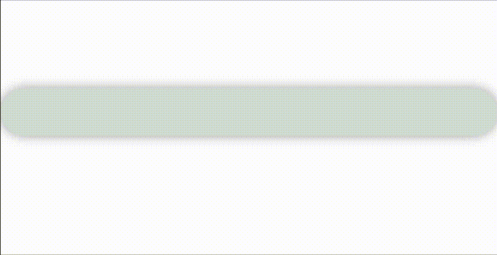

# QuickComponents

*A set of reusable components to speed up developing complex UIs with SwiftUI.*

> ⚠️ **The project is currently in very early stages of development.**
Contributions are welcome

## Getting started

**Requirements:**
- iOS 13 
- Xcode 11.4

**Installation:**
- Open Xcode Project
- Select `File -> Swift Packages -> Add Package Dependency` 
- Past this repo's url: `https://github.com/LucasCarioca/QuickComponents`

### Usage:

import the package in the file you would like to use it: `import QuickComponents`

### Documentation

You can find our documentation here: [Docs](https://quickcomponents.lucasdesouza.net)

### Component Examples

[**SwitcherView**](https://quickcomponents.lucasdesouza.net/switcherview/)
```swift
SwitcherView(pages: [
    SwitcherPage(label: "One", view: Text("Hello World!")),
    SwitcherPage(label: "Two", view: Text("GoodBye World!"))
])
```


[**BarView**](https://quickcomponents.lucasdesouza.net/barview/)
```swift
struct ProgressView: View {
    @State var timePublisher = Timer.publish(every: 1, on: .main, in: .common).autoconnect()
    @State var counter: CGFloat = 0
    var body: some View{
        BarView(value: self.counter, max: 5).onReceive(self.timePublisher) { time in
            if (self.counter < 5) {
                self.counter += 1
            }
        }
    }
}

...

ProgressView()
```



