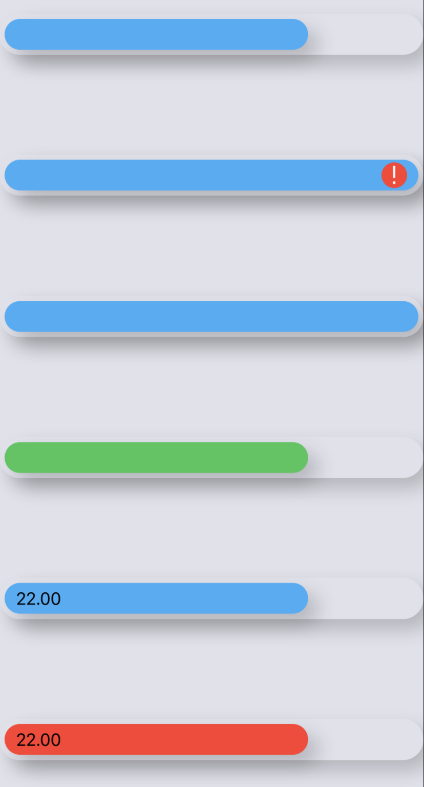

# QuickComponents

*A set of reusable components to speed up developing complex UIs with SwiftUI.*

> ⚠️ **The project is currently in very early stages of development.**
Contributions are welcome

## Getting started

**Requirements:**
- iOS 13 
- Xcode 11.4

**Installation:**
- Open Xcode Project
- Select `File -> Swift Packages -> Add Package Dependency` 
- Past this repo's url: `https://github.com/LucasCarioca/QuickComponents`

### Usage:

import the package in the file you would like to use it: `import QuickComponents`

### Documentation

You can find our documentation here: [Docs](https://quickcomponents.lucasdesouza.net)

## Component Examples

[**SwitcherView**](https://quickcomponents.lucasdesouza.net/switcherview/)
```swift
SwitcherView(pages: [
    SwitcherPage(label: "One", view: Text("Hello World!")),
    SwitcherPage(label: "Two", view: Text("GoodBye World!"))
])
```


[**BarView**](https://quickcomponents.lucasdesouza.net/barview/)
```swift
VStack {
    BarView(value: 22, max: 30)
    BarView(value: 30, max: 30)
    BarView(value: 22, max: 30, showLabel: nil, color: .green)
    BarView(value: 22, max: 30, showLabel: true, color: nil)
    BarView(value: 22, max: 30, showLabel: true, color: .red)
}
```

For a slight Neumorphic effect use the included offWhie color for the background with a barView. *Note that this will not work well with out of the box darkmode functionality.*
```swift
ZStack {
    Color.offWhite.edgesIgnoringSafeArea(.all)
    BarView(value: 22, max: 30)
}
```




## Button Styles

Based on Material UI buttons. 


[**PrimartButton**](https://quickcomponents.lucasdesouza.net/PrimartButton/)
```swift
    Button(action: {}){
        Text("Primary")
    }.buttonStyle(PrimaryButton())
        .frame(width: 100, height: 50)

    Button(action: {}){
        Text("Primary")
    }.buttonStyle(PrimaryButton(variant: .outlined))
        .frame(width: 100, height: 50)

    Button(action: {}){
        Text("Primary")
    }.buttonStyle(PrimaryButton(variant: .contained))
        .frame(width: 100, height: 50)
```

[**SecondaryButton**](https://quickcomponents.lucasdesouza.net/SecondaryButton/)
```swift
    Button(action: {}){
        Text("Secondary")
    }.buttonStyle(SecondaryButton())
        .frame(width: 100, height: 50)

    Button(action: {}){
        Text("Secondary")
    }.buttonStyle(SecondaryButton(variant: .outlined))
        .frame(width: 100, height: 50)

    Button(action: {}){
        Text("Secondary")
    }.buttonStyle(SecondaryButton(variant: .contained))
        .frame(width: 100, height: 50)
```
[**DisabledButton**](https://quickcomponents.lucasdesouza.net/DisabledButton/)
```swift
    Button(action: {}){
        Text("Disabled")
    }.buttonStyle(DisabledButton())
        .frame(width: 100, height: 50)

    Button(action: {}){
        Text("Disabled")
    }.buttonStyle(DisabledButton(variant: .outlined))
        .frame(width: 100, height: 50)

    Button(action: {}){
        Text("Disabled")
    }.buttonStyle(DisabledButton(variant: .contained))
        .frame(width: 100, height: 50)
```
## Typography

### Heading


**Sizing**

```swift
VStack {
    Text("Heading Sizes").Heading(align:.center)
    Text("H1").Heading()
    Text("H2").Heading(size: .H2)
    Text("H3").Heading(size: .H3)
    Text("H4").Heading(size: .H4)
    Text("H5").Heading(size: .H5)
    Text("H6").Heading(size: .H6)
}
```


**Alignment**

```swift
VStack {
    Text("Alginment").Heading(align:.center)
    Text("leading").Heading()
    Text("center").Heading(align: .center)
    Text("trailing").Heading(align: .trailing)
}
```


### Paragraph

**Sizing**

```swift
VStack{
    Text("Lorem ipsum ... semper vitae.").Paragraph(size: .LG)
    Text("Lorem ipsum ... semper vitae.").Paragraph()
    Text("Lorem ipsum ... semper vitae.").Paragraph(size:.SM)
}
```


**Alignment**

```swift
VStack{
    Text("Lorem ipsum ... semper vitae.").Paragraph()
    Text("Lorem ipsum ... semper vitae.").Paragraph(align: .center)
    Text("Lorem ipsum ... semper vitae.").Paragraph(align: .trailing)
}
```


