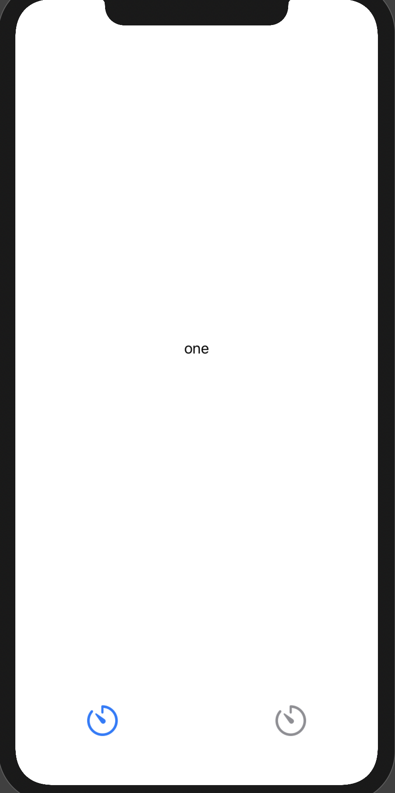
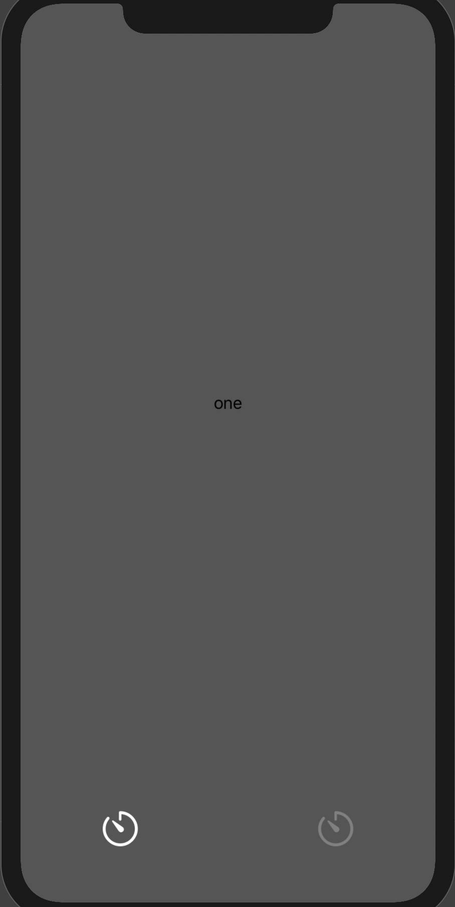

# Navigation Views

## Contents

- [Switcher View](#switcher%20view)
- [Tabbed View](#tabbed%20view)

## Switcher View

This is a very simple view that can be used to toggle between two other views. It can be placed above and below the views being toggled.

[Full documentation](https://quickcomponents.lucasdesouza.net/switcherview/)


```swift
SwitcherView(pages: [
    SwitcherPage(label: "One", view: Text("Hello World!")),
    SwitcherPage(label: "Two", view: Text("GoodBye World!"))
])
```

To place the picker below the views:


```swift
SwitcherView(pages: [
    SwitcherPage(label: "One", view: Text("Hello World!")),
    SwitcherPage(label: "Two", view: Text("GoodBye World!"))
])
```


## Tabbed View

This is a view that is intended to anchor a section or the entire application. It adds a bar at the bottom of the screen showing the tabs provided. The view above the bar will change to the view corresponding to the selected tab below. 

[Full documentation](https://quickcomponents.lucasdesouza.net/tabrootview/)

```swift
TabRootView(tabs: [
    TabPage(image: "timer", view: Text("one")),
    TabPage(image: "timer", view: Text("Two")),
    TabPage(image: "timer", view: Text("Three")),
])
```


You can also provide your own custom theme:
```swift
TabRootView(tabs: [
    TabPage(image: "timer", view: Text("one")),
    TabPage(image: "timer", view: Text("Two")),
    TabPage(image: "timer", view: Text("Three")),
], theme: TabViewTheme(backgroundColor: .darkGray, highlightColor: .white, defaultColor: .gray))
```



