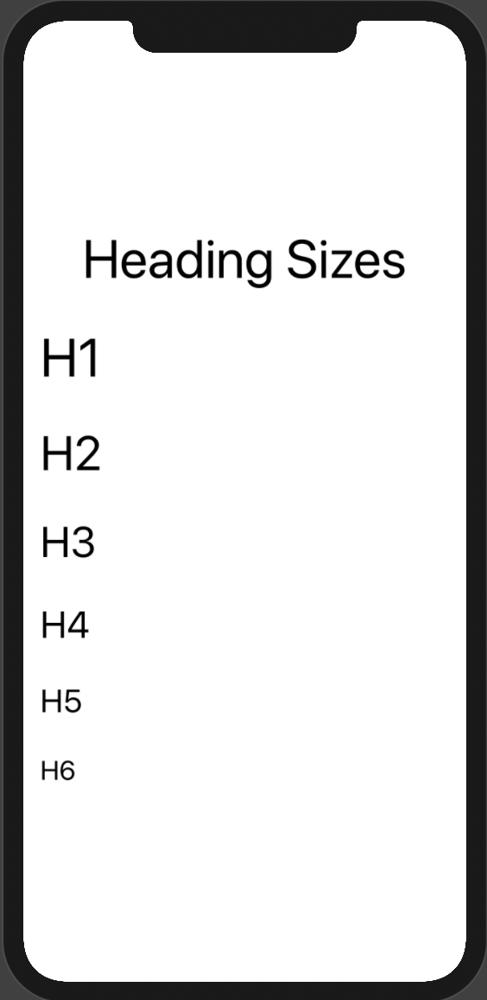
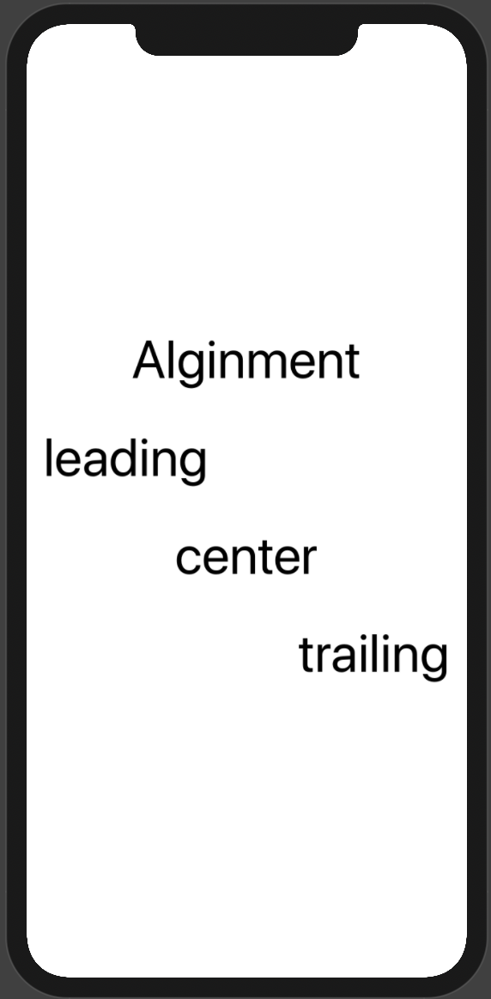
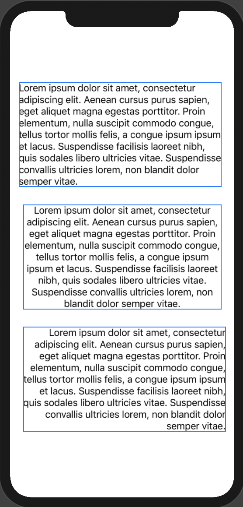

# Typography

## Contents

- [Heading](#heading)
- [Paragraph](#paragraph)
- [List](#list)


## Heading

[Full documentation](https://quickcomponents.lucasdesouza.net/heading)

### Sizing

```swift
VStack {
    Text("Heading Sizes").Heading(align:.center)
    Text("H1").Heading()
    Text("H2").Heading(size: .H2)
    Text("H3").Heading(size: .H3)
    Text("H4").Heading(size: .H4)
    Text("H5").Heading(size: .H5)
    Text("H6").Heading(size: .H6)
}
```



### Alignment

```swift
VStack {
    Text("Alginment").Heading(align:.center)
    Text("leading").Heading()
    Text("center").Heading(align: .center)
    Text("trailing").Heading(align: .trailing)
}
```



## Paragraph

[Full documentation](https://quickcomponents.lucasdesouza.net/paragraph)

### Sizing

```swift
VStack{
    Text("Lorem ipsum ... semper vitae.").Paragraph(size: .LG)
    Text("Lorem ipsum ... semper vitae.").Paragraph()
    Text("Lorem ipsum ... semper vitae.").Paragraph(size:.SM)
}
```


### Alignment

```swift
VStack{
    Text("Lorem ipsum ... semper vitae.").Paragraph()
    Text("Lorem ipsum ... semper vitae.").Paragraph(align: .center)
    Text("Lorem ipsum ... semper vitae.").Paragraph(align: .trailing)
}
```



## List

### Ordered list

[Full documentation](https://quickcomponents.lucasdesouza.net/OrderedList)

```swift
OrderedList(items: [
    "step one",
    "step two",
    "step three"
])
```


### Unordered List

[Full documentation](https://quickcomponents.lucasdesouza.net/UnorderedList)

```swift
UnorderedList(items: [
    "step one",
    "step two",
    "step three"
])
```

